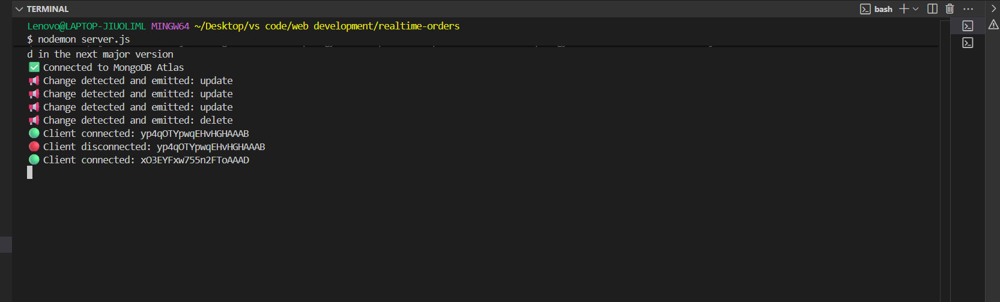
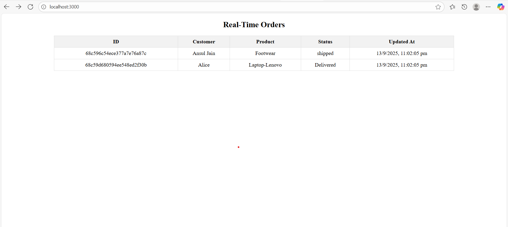

```
📦Real-Time Orders Tracking System

    A real-time system that updates all connected clients instantly whenever the database changes.
    No need for refreshing or frequent polling updates are pushed automatically using MongoDB Change Streams and Socket.IO.

✨Features:
   🔹📡Real-Time Updates: Clients get notified instantly when an order is inserted, updated, or deleted.
   🔹⚡No Polling Needed: Event-driven design improves efficiency.
   🔹👨‍💻API + UI: REST API for CRUD operations, plus a frontend table that updates dynamically.
   🔹🧑‍🤝‍🧑Multi-Client Support: Updates are broadcasted to all connected clients.
   🔹📊Scalable Design: Can be extended for chat apps, dashboards, IoT, etc.

🛠 Tech Stack
   🔹Backend: Node.js, Express.js
   🔹Database: MongoDB (with Change Streams)
   🔹Realtime Communication: Socket.IO
   🔹Frontend: HTML, CSS
   🔹Tools: Postman (for testing APIs)

⚙️ Installation & Setup
  
  1. Clone Repository
   ->git clone https://github.com/ansuljain789/Real-Time-Orders.git
   ->cd Real-Time-Orders

  2. Install Dependencies
   ->npm install

  3. Configure Environment Variables
    ->Create a .env file in the root:
       PORT=3000 //you can take any port number here e.g:3000,5000..

       MONGO_URI=mongodb://localhost:27017/yourDataBaseName  (You can use MongoDb atlas cloud)
       or MONGO_URI=mongodb+srv://<username>:<password>@clusterone.p7mhd.mongodb.net/yourDataBaseName

  4. Run Backend Server
    -> npm run dev

Now Server will run at 👉 http://localhost:3000
if you want to show it in frontend about all updates the you can show in frontend

  5. Access Frontend
    ->Open http://localhost:3000 in your browser.

📐 System Architecture
          ┌───────────────┐
          │   Client UI   │  (index.html with Socke.IO)
          └───────┬───────┘
                  │
                  ▼
          ┌───────────────┐
          │   Express.js  │  (server.js)
          └───────┬───────┘
                  │
   ┌──────────────┴──────────────┐
   │                             │
   ▼                             ▼
Socket.IO                  REST API Endpoints
(orderChange events)       (/api/orders CRUD)
   │                             │
   └──────────────┬──────────────┘
                  │
                  ▼
          ┌───────────────┐
          │   MongoDB DB  │
          │ (ChangeStream)│
          └───────────────┘

🔄 Flow Diagram
  1.Client sends a new order (via API/Postman).
  2.MongoDB Change Stream detects the insertion.
  3.Backend captures the change and emits an event via Socket.IO.
  4.All connected clients update their UI instantly.

📂 Project Structure
  

REALTIME-ORDERS/
│
├── config/               # Configuration files (e.g., database connection, environment setup)
│    └── db.js  
├── controllers/          # Request handlers containing the main business logic
│    └── orderController.js         
├── models/               # Mongoose models / database schemas
│    └── orderRoutes.js
├── node_modules/         # Installed dependencies (auto-generated)
├── public/               # Static files (HTML, CSS, JS for frontend if needed)
│    └── orderRoutes.js 
├── routes/               # API route definitions (maps endpoints to controllers)
│    └── orderRoutes.js           
├── services/             # Service layer (helper functions, socket handling, business services)
│    └── orderRoutes.js      
├── .env                  # Environment variables (DB URL, PORT, secrets)
├── .gitignore            # Files and folders to be ignored by Git
├── package.json          # Project metadata, dependencies, and scripts
├── package-lock.json     # Dependency lock file (ensures consistent installs)
├── README.md             # Project documentation
├── server.js             # Main server entry point (Express + Socket.IO setup)
└── simulate.js           # Script to simulate database changes for testing real-time updates

▶️ How to Test
   1:Start backend server (npm start).
   2:Open frontend at http://localhost:3000.
   🔎 Postman Testing (Step-by-Step)
        We used Postman to test all API endpoints of the Real-Time Order System and verify that both the backend API and the real-time frontend table are working correctly.

     1. To Insert New Order (POST Request)

         Endpoint: POST http://localhost:3000/api/orders
         Body (JSON):
         {
           "customer_name": "John Doe",
           "product_name": "Smartphone",
           "status": "pending"
         }

         Expected Result in Postman: Response returns 201 Created with the inserted order JSON.
         Output in Postman:
            {
               "insertedId": "68c59d680594ee548ed2f30b"
            }
         Expected Result in Frontend:
         A new row immediately appears in the Real-Time Orders Table with the order details.
         No refresh or reload required.

    2. TO Fetch All Orders (GET Request)
         🔹Endpoint: GET http://localhost:3000/api/orders
         🔹Action in Postman: Run GET request.
         🔹Expected Result in Postman: Returns an array of all stored orders.
         🔹Expected Result in Frontend:
         🔹On initial page load, the table is populated using this endpoint.
         🔹Matches exactly what Postman shows.

    3. Update an Order (PUT Request)
       Endpoint: PUT http://localhost:3000/api/orders/:id
      Example:
        🔹PUT http://localhost:3000/api/orders/68c5527969339711a11ba043
        🔹 Body (JSON):
            {
             "status": "shipped"
            }
        🔹Expected Result in Postman: Response returns updated JSON with new status.
        🔹Expected Result in Frontend:
        🔹The specific row in the table updates its status column from pending → shipped instantly.
        🔹Other fields remain unchanged.

    4. Delete an Order (DELETE Request)
        🔹Endpoint: DELETE http://localhost:3000/api/orders/:id
        🔹Expected Result in Postman: Response returns confirmation message (Order deleted successfully).
        🔹Expected Result in Frontend:
        🔹The corresponding row disappears from the table immediately.

    5. Real-Time Verification
        🔹For each request above:
        🔹Postman verifies the API works correctly.
        🔹The frontend verifies the real-time socket system works correctly.
        🔹No polling or manual refresh is required → the updates are instant. 

✅ Why This Matters in Testing:
   🔹Postman validates API correctness (CRUD operations).
   🔹Frontend validates real-time event propagation (MongoDB Change Streams → Socket.IO → Browser).
   🔹Together, this proves the system is both functionally correct and real-time efficient.
         

📊Frontend Orders Table:
+--------------------------+--------------+-------------+-----------+---------------------+
| ID                       | Customer     | Product     | Status    | Updated At          |
+--------------------------+--------------+-------------+-----------+---------------------+
| 68c5527969339711a11ba043 | John Doe     | Smartphone  | pending   | 2025-09-13 11:06:56 |
| 68c5527969339711a11ba099 | Alice        | Laptop      | shipped   | 2025-09-13 11:10:32 |
+--------------------------+--------------+-------------+-----------+---------------------+
```

## 📸 Backend Screenshot


## 📸 Frontend Screenshots

<p float="left">
  
</p>


## 📸 Postman Screenshots

<p float="left">
  
  
</p>

<p float="left">
  
  
</p>

 


  


   

    


